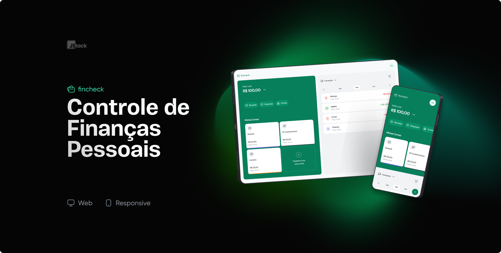

<h1 align="center">
  
</h1>

  

 

## 🚀 Tecnologias

Este projeto foi desenvolvido com as seguintes tecnologias:

- Vite
- React
- TypeScript
- TailwindCSS
- React Hook Forms (com Zod)
- React Query
- Radix UI (components e icones)
- React Hot Toast
- Swiper

## 💻 Projeto

O Fincheck é uma plataforma simples e intuitiva para que você possa controlar suas finanças pessoais.

Este projeto tem outra parte: a API ([BackEnd](https://github.com/jotahdavid/fincheck-api)) que realiza a autenticação do usuário, além de trazer, salvar e atualizar transações, contas e categorias.

## 📥 Instalando o Projeto

### Programas necessários

- Git **(ou baixe o repositório como .zip)**
- Node **(preferência na versão v18.13.0 ou maior)**
- Projeto [Fincheck (API)](https://github.com/jotahdavid/fincheck-api) rodando na máquina

### Etapas

- Vá até a pasta do projeto `fincheck` e rode o comando `yarn` ou `npm install` para instalar as dependências do projeto;
- Crie o arquivo `.env` na raíz do projeto e adicione as variáveis necessárias como mostra no arquivo de exemplo: `.env.example`;
- Na variável de ambiente `VITE_API_URL`, coloque a URL do projeto [Fincheck (API)](https://github.com/jotahdavid/fincheck-api) em execução;
- Rode o comando de build `yarn build` ou `npm run build`;
- Por fim, rode o projeto com o comando `yarn preview` ou `npm run preview` e abra o link que aparece no terminal em seu navegador;
